# dbt Knowledge Graph & Impact Analysis

A comprehensive solution for building knowledge graphs from dbt manifests and performing interactive impact analysis. This tool helps data teams understand dependencies, assess change impacts, and visualize relationships across their dbt projects.

## 🎯 Overview

This project consists of these main components:
1. **Knowledge Graph Builder** (`manifest_parser.py`) - Parses dbt manifests into structured graphs
2. **Impact Analysis App** (`impact_analysis_app.py`) - Interactive Streamlit app using streamlit-agraph
3. **Plotly Impact Analysis App** (`impact_analysis_app_plotly.py`) - **Snowflake Streamlit compatible** version using Plotly
4. **GraphViz Impact Analysis App** (`impact_analysis_app_graphviz.py`) - **Professional layouts** using PyGraphviz
5. **Cytoscape Impact Analysis App** (`impact_analysis_app_cytoscape.py`) - **Interactive & Snowflake compatible** using st-link-analysis

## 📊 Data Flow Architecture

### Complete Data Processing Pipeline

```mermaid
graph TD
    A["📁 Data Source<br/>• nodes.json<br/>• edges.json<br/>• *.gpickle"] --> B["🧠 Graph Loading<br/>load_graph_data()<br/>NetworkX Graph"]
    B --> C["🔍 Node Filtering<br/>get_nodes_by_type()<br/>Filtered Nodes"]
    C --> D["🎯 Selected Node<br/>User Choice +<br/>Analysis Config"]
    D --> E["📊 Impact Analysis<br/>create_impact_subgraph()<br/>Subgraph + Impact Sets"]
    E --> F["🎨 Node & Edge Consolidation<br/>_consolidate_source_nodes_for_viz()<br/>Visual Element Mapping"]
    F --> G["🖼️ Visualization<br/>create_impact_visualization()<br/>Visual Elements"]
    G --> H["🌐 User Interface<br/>• Metrics<br/>• Tables<br/>• Interactive Graph"]
    
    subgraph "Data Loading Layer"
        A
        B
    end
    
    subgraph "Selection & Analysis Layer"
        C
        D
        E
    end
    
    subgraph "Visualization Layer"
        F
        G
    end
    
    subgraph "Presentation Layer"
        H
    end
    
    style A fill:#e1f5fe
    style B fill:#e8f5e8
    style C fill:#fff3e0
    style D fill:#fce4ec
    style E fill:#f3e5f5
    style F fill:#e0f2f1
    style G fill:#fff8e1
    style H fill:#f1f8e9
```



### Step-by-Step Data Flow

#### **Step 1: Data Source Loading**
- **Input**: `data/knowledge_graph.gpickle` (primary) or `data/nodes.json` + `data/edges.json` (fallback)
- **Function**: `load_graph_data()`
- **Output**: NetworkX MultiDiGraph with all dbt nodes and relationships
- **Caching**: Streamlit cache for fast subsequent loads

#### **Step 2: Node Selection & Filtering**
- **Function**: `get_nodes_by_type(graph, node_type)`
- **Process**: Extract nodes by type (source, model, test, etc.) with special source deduplication
- **User Interaction**: Select node type → Search/filter → Choose specific node

#### **Step 3: Impact Analysis**
- **Function**: `create_impact_subgraph()`
- **Process**: 
  - Get upstream dependencies (configurable depth)
  - Get downstream impacts (configurable depth)
  - Apply filters (tests, columns, packages)
  - Special aggregation for sources across packages

#### **Step 4: Source Consolidation**
- **Function**: `_create_aggregated_source_impact()`
- **Purpose**: Combines multiple instances of same source (e.g., `access_shared.assignment_daily` across 6 packages)
- **Result**: Single impact analysis representing all source instances

#### **Step 5: Visualization Preparation**
- **Node Consolidation**: `_consolidate_source_nodes_for_viz()` - Groups similar nodes
- **Visual Mapping**: Node attributes → Color, size, shape based on impact role
- **Edge Processing**: Maps relationships to visual connections with appropriate styling

#### **Step 6: Interactive Rendering**
- **Components**: Visual nodes + edges + configuration
- **Layout**: Physics-based with large canvas (2000×1400px)
- **Interaction**: Hover tooltips, click events, navigation controls

## 🚀 Quick Start

### 1. Generate Knowledge Graph
```bash
# Parse dbt manifest and create all necessary files
python manifest_parser.py code_docs/manifest.json --storage-dir data --export-viz
```

### 2. Choose Your Visualization Method

#### Option A: Standard Version (streamlit-agraph)
```bash
# For local development or environments with streamlit-agraph
streamlit run impact_analysis_app.py
```

#### Option B: Snowflake Streamlit Version (Plotly)
```bash
# For Snowflake Streamlit or environments without streamlit-agraph
streamlit run impact_analysis_app_plotly.py
```

#### Option C: Professional Layout Version (GraphViz)
```bash
# For high-quality static graph rendering with professional layouts
streamlit run impact_analysis_app_graphviz.py
```

#### Option D: Interactive Snowflake Version (Cytoscape)
```bash
# For interactive graphs compatible with Snowflake Streamlit
streamlit run impact_analysis_app_cytoscape.py
```

### 3. Access the Application
Open http://localhost:8501 in your browser to use the interactive impact analysis interface.

## 📁 File Structure

### Generated Output Files

#### Primary Storage (`data/` directory)
- `nodes.json` - All nodes with properties and metadata
- `edges.json` - All relationships between nodes
- `knowledge_graph.gpickle` - NetworkX graph for fastest loading
- `graph_metadata.json` - Creation time, statistics, file information

#### Visualization Files (`visualization/` directory)
- `knowledge_graph.graphml` - For Gephi, Cytoscape
- `knowledge_graph.gml` - For various graph analysis tools
- `visualization_data.json` - For web-based visualizations

## 🔧 Advanced Usage

### Knowledge Graph Builder Options

```bash
# Basic workflow (recommended)
python manifest_parser.py code_docs/manifest.json

# With visualization export
python manifest_parser.py code_docs/manifest.json --export-viz

# Custom output directory
python manifest_parser.py code_docs/manifest.json --storage-dir my_output

# Load existing graph (fast)
python manifest_parser.py code_docs/manifest.json --load-only

# Legacy export format
python manifest_parser.py code_docs/manifest.json --legacy-export nodes.json,edges.json

# Verbose logging
python manifest_parser.py code_docs/manifest.json --verbose
```

### Programmatic Usage

```python
from manifest_parser import ManifestParser

# Simple workflow - parse and store everything
parser = ManifestParser('path/to/manifest.json', 'output_dir')
graph = parser.build_and_store_graph()

# Load existing graph
parser = ManifestParser('path/to/manifest.json', 'output_dir') 
graph = parser.load_graph()

# Export visualizations
parser.export_for_visualization('viz_output')
```

## 🎨 Impact Analysis Features

### Interactive Visualization
- **Physics-based layout** with natural node spacing
- **Color-coded nodes** by type and impact role
- **Consolidated sources** - Multiple source instances shown as single nodes
- **Hover tooltips** with node identification
- **Configurable depth** for upstream/downstream analysis

### Analysis Capabilities
- **Impact Metrics**: Upstream dependencies, downstream impacts, total affected nodes
- **Risk Assessment**: Automatic risk level calculation with specific factors
- **Package Analysis**: Cross-package dependency tracking
- **Critical Node Detection**: Identify high-impact nodes with treemap visualization
- **Source Aggregation**: Unified analysis across multiple source instances

### User Interface
- **Sidebar Controls**: Node type selection, search, analysis configuration
- **Tabbed Interface**: 
  - Impact Analysis (detailed tables)
  - Visualization (interactive graph)
  - Node Details (selected node information)
  - Critical Nodes (treemap drill-down)

## 🔍 Key Data Transformations

### Source Name Standardization
- **Before**: `account_edp_optimized`
- **After**: `account_optimized.account_edp_optimized`
- **Format**: `source_name.table_name` for all sources

### Source Consolidation Example
```
Before: 6 separate nodes
├── source.package1.access_shared.assignment_daily
├── source.package2.access_shared.assignment_daily
├── source.package3.access_shared.assignment_daily
├── source.package4.access_shared.assignment_daily
├── source.package5.access_shared.assignment_daily
└── source.package6.access_shared.assignment_daily

After: 1 consolidated node
└── source_access_shared.assignment_daily
    ├── Represents all 6 packages
    ├── Aggregated impact analysis
    └── All connecting arrows visible
```

### Visual Optimization
- **Node sizes**: Selected (16px), Connected (12px), Others (10px)
- **Edge widths**: Key connections (3px), Related (2px), Others (1px)
- **Canvas**: Large 2000×1400px for readability
- **Labels**: Truncated at 20 characters with ellipsis

## 🛠️ Technical Details

### Dependencies

#### Standard Version (`impact_analysis_app.py`)
- **streamlit** - Web application framework
- **networkx** - Graph data structure and algorithms
- **pandas** - Data manipulation and analysis
- **plotly** - Interactive charts and visualizations
- **streamlit-agraph** - Interactive graph visualization component

#### Snowflake Streamlit Version (`impact_analysis_app_plotly.py`)
- **streamlit** - Web application framework
- **networkx** - Graph data structure and algorithms
- **pandas** - Data manipulation and analysis
- **plotly** - Interactive charts and visualizations (replaces streamlit-agraph)

#### GraphViz Version (`impact_analysis_app_graphviz.py`)
- **streamlit** - Web application framework
- **networkx** - Graph data structure and algorithms
- **pandas** - Data manipulation and analysis
- **plotly** - Interactive charts for analysis tables
- **pygraphviz** - Professional graph layout and rendering

#### Cytoscape Version (`impact_analysis_app_cytoscape.py`)
- **streamlit** - Web application framework
- **networkx** - Graph data structure and algorithms
- **pandas** - Data manipulation and analysis
- **plotly** - Interactive charts for analysis tables
- **st-link-analysis** - Interactive Cytoscape.js graph visualization

### Performance Features
- **Caching**: Streamlit cache for graph loading
- **Pickle storage**: Fast binary serialization for large graphs
- **JSON fallback**: Human-readable format when needed
- **Progressive loading**: Load only what's needed for analysis

### Error Handling
- **KeyError protection**: Graceful handling of missing nodes
- **Edge validation**: Skip problematic connections without crashing
- **Cache refresh**: Manual cache clearing for data inconsistencies
- **User feedback**: Clear error messages with actionable guidance

## 📈 Use Cases

### Data Engineering Teams
- **Change Impact Assessment**: Understand what breaks when modifying models
- **Dependency Mapping**: Visualize complex relationships across projects
- **Source Analysis**: Track which models use specific data sources
- **Package Management**: Analyze cross-package dependencies

### Data Analysts
- **Lineage Exploration**: Follow data from source to final outputs
- **Model Understanding**: See how models relate to each other
- **Impact Estimation**: Assess scope of changes before implementation

### DevOps & CI/CD
- **Automated Testing**: Identify affected tests for selective running
- **Deployment Planning**: Understand deployment order based on dependencies
- **Risk Management**: Prioritize testing based on downstream impact

## 🏔️ Snowflake Streamlit Deployment

### Using the Plotly Version in Snowflake

#### 1. Prepare Your Files
```bash
# Generate the knowledge graph data locally first
python manifest_parser.py code_docs/manifest.json --storage-dir data --export-viz
```

#### 2. Upload to Snowflake Stage
```sql
-- Create a stage for your app files
CREATE STAGE dbt_impact_analysis;

-- Upload files to the stage
PUT file://impact_analysis_app_plotly.py @dbt_impact_analysis;
PUT file://data/knowledge_graph.gpickle @dbt_impact_analysis/data/;
PUT file://data/graph_metadata.json @dbt_impact_analysis/data/;
PUT file://requirements_plotly.txt @dbt_impact_analysis;
```

#### 3. Create Streamlit App in Snowflake
```sql
CREATE STREAMLIT dbt_impact_analysis
  ROOT_LOCATION = '@dbt_impact_analysis'
  MAIN_FILE = 'impact_analysis_app_plotly.py'
  QUERY_WAREHOUSE = 'YOUR_WAREHOUSE';
```

#### 4. Key Differences in Snowflake Version
- ✅ **Plotly network graphs** instead of streamlit-agraph
- ✅ **Interactive zoom, pan, hover** functionality
- ✅ **All visualization features** preserved
- ✅ **Same analysis capabilities** as original
- ✅ **Better performance** on large graphs

## 🔧 Migration Guide

### From graph_storage.py
If you were previously using `graph_storage.py`:

**Old Command:**
```bash
python graph_storage.py manifest.json --export-viz
```

**New Command:**
```bash
python manifest_parser.py manifest.json --export-viz
```

All functionality has been consolidated into `manifest_parser.py` with improved performance and consistency.

### From streamlit-agraph to Plotly
If deploying to Snowflake Streamlit:

**Local Development:**
```bash
streamlit run impact_analysis_app.py  # Uses streamlit-agraph
```

**Snowflake Streamlit:**
```bash
streamlit run impact_analysis_app_plotly.py  # Uses Plotly
```

Both versions provide the same functionality with identical analysis features.

## 🐛 Troubleshooting

### Common Issues

#### KeyError when selecting nodes
- **Cause**: Stale cache or outdated graph data
- **Solution**: Click "🔄 Refresh Data" in sidebar or regenerate graph

#### Missing connections in visualization
- **Cause**: Node limiting or filtering
- **Solution**: Adjust analysis depth or disable filters

#### Slow loading
- **Cause**: Large graph or JSON loading
- **Solution**: Ensure `.gpickle` files are generated for faster loading

### Performance Tips
- Use pickle files for fastest loading
- Limit analysis depth for large graphs
- Use source aggregation for complex dependency networks
- Clear cache periodically to free memory

## 📝 Contributing

When contributing to this project:
1. Maintain backward compatibility with existing graph files
2. Add comprehensive error handling for new features
3. Update documentation for any API changes
4. Test with large dbt projects to ensure performance

## 📄 License

This project is designed for data teams working with dbt and provides a comprehensive solution for understanding and managing complex data pipelines through interactive visualization and analysis.
